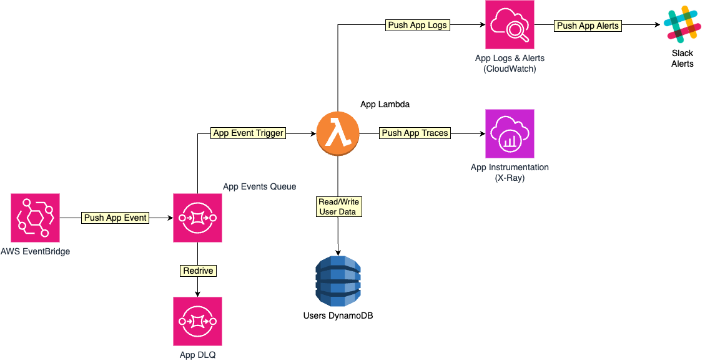

# Terraform Challenge

- [Terraform Challenge](#terraform-challenge)
  - [Intro](#intro)
  - [Requirements](#requirements)
  - [Overview](#overview)
  - [Deploying the FD application stack](#deploying-the-fd-application-stack)
  - [Future improvements](#future-improvements)


## Intro

Please create a directory that contains Terraform configuration that can deploy a Lambda, DynamoDB table and SQS queue into AWS. This Lambda must have a SQS trigger, and then be able to write data onwards to DynamoDB.

**Note:**

You do not have to include application code for the Lambda.

## Requirements

Your configuration must follow the below specification:

**Generic:**
- Your state file must be stored remotely
- Any supporting configuration such as IAM policies
- Designed in a way it can be deployed to two different environments (i.e. development and production)
- Sensible tagging in place to differentiate between environments
- You may call the resources whatever you wish

**Lambda:**
- You may choose any language of choice for the Lambda engine
- It must be able to publish metrics and logs to CloudWatch and traces to X-Ray

**DynamoDB:**
- You must enable TTL.
- The table should be able to scale infinitely
- There must be a hash key of `ID` and a sort key of `userId`
- The data can be recovered at any chosen point

**SQS:**
- A sensible redrive policy fit for a production environment is required
- You do not need to worry about how data gets onto the queue

## Overview

The following diagram should give a perspective about the FD stack components and their interaction:



## Deploying the FD application stack

**Prerequisites:**
- Docker desktop - download it from [here](https://docs.docker.com/desktop/)
- Localstack - download it from [here](https://docs.localstack.cloud/getting-started/installation/)
- Terraform CLI (the `tflocal` wrapper that works with Localstack) - download it from [here](https://github.com/localstack/terraform-local)
- AWS CLI (the `awslocal` wrapper that works with Localstack) - download it from [here](https://github.com/localstack/awscli-local)

The FD application stack uses AWS cloud infrastructure and two environments: `development` and `production`. For now it's single account/region based (us-east-1) but it can be extended to support multiple accounts/regions.

Steps to deploy the FD app stack to the `development` environment (`production` follows a similar process):

1. Make sure `locastack` is started and running first
2. Clone the `bf-homework` repo:
    ```
    git clone https://github.com/mtiutiu/bf-homework.git
    ```
3. Change directory to the `development` environment example:
    ```
    cd bf-homework/terraform/examples/fd-stack/environments/development
    ```
4. Bootstrap the S3 bucket used to store the remote Terraform state (`awslocal` is a thin wrapper for the `aws` CLI that works with `localstack` out of the box):
    ```
    awslocal s3api create-bucket --bucket terraform --region us-east-1
    ```
5. Run Terraform init first to initalize the S3 remote state backend (`tflocal` is a thin wrapper for the `terraform` CLI that works with `localstack` out of the box):
    ```
    tflocal init
    ```
6. Run Terraform plan to preview infrastructure changes first:
    ```
    tflocal plan
    ```
7. If all looks good then apply changes:
    ```
    tflocal apply
    ```

If everything goes well all infrastructure components should be provisioned in the `localstack` environment:
- The S3 bucket for storing Terraform state
- The SQS queue used to trigger the application lambda function (also the SQS DLQ)
- The DynamoDB users table
- CloudWatch app logs stream

## Future improvements

A few improvements can be made such as:

- Multi account and region support
- Better state file management and split across applications/regions (avoid TF state file monolithic design)
- Handle configuration data and state file via Terragrunt
- Move TF modules in a separate Git repo(s) for versioning and promote immutability
- Terraform remote state locking - useful when working on a project where many people are working on the same Terraform project
- Terraform workspaces for better handling of environments if Terragrunt is not an option